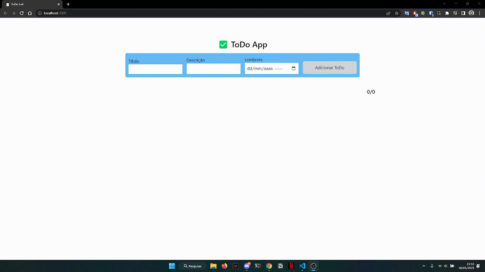

<div align="center" id="top"> 
  
  &#xa0;
</div>

<h1 align="center">✅ ToDo List</h1>

<p align="center">
  
  
  
  
  <a href="https://wakatime.com/badge/user/5dd5545b-543c-4824-a140-01a69ef7da68/project/a69e554a-0794-4f5a-a5c4-c768b4a1fd60"></a>
</p>


<hr> 

<p align="center">
  <a href="#dart-about">About</a> &#xa0; | &#xa0; 
  <a href="#rocket-technologies">Technologies</a> &#xa0; | &#xa0;
  <a href="#white_check_mark-requirements">Requirements</a> &#xa0; | &#xa0;
  <a href="#checkered_flag-starting">Starting</a> &#xa0; | &#xa0;
  <a href="#memo-license">License</a> &#xa0; | &#xa0;
  <a href="https://github.com/LeticiaFarias" target="_blank">Author</a>
</p>

<br>

## :dart: About ##

Task management application (To-Do List) with ReactJS.


## :rocket: Technologies ##

The following tools were used in this project:

- [React](https://pt-br.reactjs.org/)
- [TypeScript](https://www.typescriptlang.org/)
- [Recoil](https://recoiljs.org/)
- [Tailwind CSS](https://tailwindcss.com/)
- [React Router](https://reactrouter.com/en/main)
- [Vite](https://vitejs.dev/)
- [Day.js](https://day.js.org/)
- [clsx](https://github.com/lukeed/clsx)
- [Phosphor](https://phosphoricons.com/)
- [uuid](https://github.com/uuidjs/uuid)

## :white_check_mark: Requirements ##

Before starting :checkered_flag:, you need to have [Git](https://git-scm.com) and [Node](https://nodejs.org/en/) installed.

## :checkered_flag: Starting ##

```bash
# Clone this project
$ git clone https://github.com/LeticiaFarias/todo-reactjs

# Access
$ cd todo-reactjs

# Install dependencies
$ yarn

# Run the project
$ yarn dev

# The server will initialize in the <http://localhost:3000>
```

## :memo: License ##

This project is under license from MIT. For more details, see the [LICENSE](LICENSE.md) file.


Made with :heart: by <a href="https://github.com/LeticiaFarias" target="_blank">Letícia</a>

&#xa0;

<a href="#top">Back to top</a>
